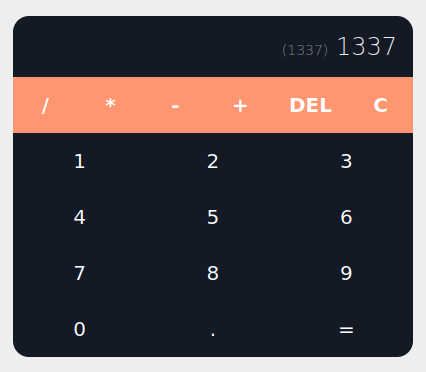
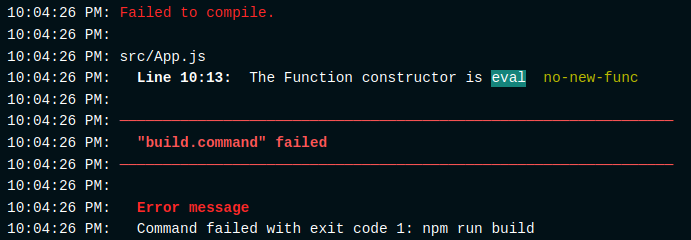

# React calculator App Rework

I came across this react youtube tutorial and decided that it could be done with a few extra enhancements. You can find the tutorial at [Build a CALCULATOR APP in REACT JS | A React JS Beginner Tutorial](https://www.youtube.com/watch?v=oiX-6Y2oGjI).
Please kindly show only love to the creator of the video for creating a usefull tutorial.

## Final Output

You can find the live version of this app [here](https://vigorous-chandrasekhar-cf3737.netlify.app/)!

## Enhancements

### Replacing javascript eval() with mathjs.evaluate()

One of the main code decisions that I believe could be enhanced is the creators usage of the `eval` functionality. While there are different school of thoughts on the usage of eval in javascript when parsing string that has interaction with end users, it is more often than not acknowledged that using eval does pose certain risks.

To further cement the decision of replacing the eval functionality, when I tried to replace `eval` with a `Function` statement (which inherently does the same thing) Netflify produced this error message duing build and cancelled the build.

To workaround this instead of using eval, I decided to use the [mathjs](https://mathjs.org/) library. mathjs contains an `evaluate` function which gives us the result that we need with minor changes to the original creators code.

**Note: the evaluate function in mathjs executes the expressions in a sandboxed environment to reduce the potential risk of missuse, `however` there may be unknown security vulnerabilities, hence it is advised to be extra carefull when implementing the use of this function especially in server side scripts **

### Adding checks to reduce out-of-bounds error

When using the DEL button in the app, the original creator used a method to slice() the last character of the string and returning the new sliced string as the updated string. This works well except when there is only one character left in the string which then throws an error in the console.

To overcome this I have added a check to ensure that if it is the last character and the DEL button is pressed the string will not splice but instead become empty string.

### Adding a C button

While the delete button works if you need to edit the character inputted, a clear button is extremely usefull and I would believe an important part of a calculator. It just makes life easier!
